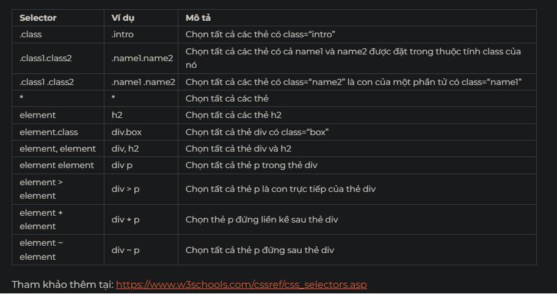

# HTML CSS TỪ ZERO ĐẾN HERO

## I. BẮT ĐẦU
### 1. Bạn sẽ làm được gì sau khóa học?
 1. Xây dựng được giao diện website
 2. Phân tích giao diện website
 3. Đặt tên class theo chuẩn BEM
 4. Xây dựng layout với Flexbox
 5. Làm hiệu ứng với animation
 6. Xây dựng giao diện responsive
 7. Rất nhiều các kỹ thuật nâng cao khác

### 2. Tìm hiểu về HTML, CSS
 1. HTML là chữ viết tắt của Hypertext Markup Language
 2. CSS là ngôn ngữ tạo phong cách cho trang web - Cascading Style Sheet languague.

### 3. Làm quen với Dev tools

 - Dev tool (F12) trong Google Chrome.
 - Tab element, network, source,...

### 4. Cài đặt VS Code, Page Ruler extension
 - Vscode + live server
 - Smart page ruler
 - <https://codeforgeek.com/best-visual-studio-code-extensions-web-development/>
 - Best usefull hotkey
 - <https://cult.honeypot.io/reads/20-vs-code-shortcuts-developers/>

### 5. Lưu ý khi học lập trình tại F8
 <https://fullstack.edu.vn/learning/html-css?id=4fa93b5a-f764-443f-8991-aeeac35ec986>

## II. LÀM QUEN VỚI HTML

### 6. Cấu trúc của 1 file HTML

><!DOCTYPE html>
<html lang="en">
 <!-- head setting -->
<head>
    <meta charset="UTF-8">
    <meta http-equiv="X-UA-Compatible" content="IE=edge">
    <meta name="viewport" content="width=device-width, initial-scale=1.0">
    <title>Demo Shop</title>  <!-- SEO google keyword -->
</head>
  <!-- body content-->
<body>
</body>
</html>

### 7. Làm quen với màn thử thách

- Pass

### 8. Ví dụ cấu trúc file HTML

- Pass

### 9. Comments trong HTML

- Ctrl + / để comment line.

### 10. Ví dụ comments trong HTML

- Pass
### 11. Các thẻ HTML thông dụng

11:08

### 12. Ví dụ thẻ HTML thông dụng

1. h1 - h6: Heading 1-6
2. p (paragraph): đoạn văn
3. img (image): hình ảnh
    - src: link ảnh
    - alt: nếu hình ảnh lỗi thì hiển thị text
4. a (anchor): thẻ gán link
    - href: link nguồn
5. ul/ol (unordered list/ordered list), li (list item):
6. table:
    - thead (table  heading)
        - th: hiển thị heading dưới dạng bold và center-align
    - tbody (table  body)
        - tr (table row): Các dòng của table, tối thiểu cần có 1 dòng.
        - td (table cell): các ô trên một dòng.
7. input: <https://www.w3schools.com/tags/tag_input.asp>
8. button:<<https://www.w3schools.com/tags/tag_button.asp>
9. div: tạo 1 khổi giúp gom gọn các tag.

### 13. Bài tập thẻ HTML thông dụng #1

- Pass

### 14. Bài tập thẻ HTML thông dụng #2

- Pass

### 15. Bài tập thẻ HTML thông dụng #3

- Pass

### 16. Attribute trong HTML là gì?

- Attribute là thuộc tính của 1 tag và nằm trong thẻ mở.
    - vd: title, onclick, style,...

### 17. Bài tập sử dụng Attribute #1

- Pass

### 18. Cách quản lý thư mục dự án

- Tạo và sắp xếp thư mục với workspace
- Quy tắc đặt tên

### 19. Feedback: Bạn đang sử dụng hệ điều hành nào?
- Done

## LÀM QUEN VỚI CSS

### 20. Sử dụng CSS trong HTML

- Có 3 cách sử dựng CSS
    - External (link file CSS để format HTML)
    - Internal (CSS được viết trong tag Style và nằm trong phần head của file HTML)
    - Inline ( sử dụng attribute style để viết CSS format HTML inline trên tag)
- Inline có độ ưu tiên cao nhất, tuỳ theo thứ tự của External và Internal trong phần head, CSS nào áp dụng sau sẽ đè lên cái trước và được hiển thị

### 21. Thực hành sử dụng CSS internal

- Pass

### 22. ID và Class

- Thuộc tính ID dùng để tạo 1 định danh duy nhất cho 1 element
- Thuộc tính Class dùng để tạo 1 lớp các element có cùng 1 định dạng CSS, 1 thẻ có thể có nhiều class và được cách nhau bằng khoảng trắng
    - ID sẽ được ưu tiên hơn so với class trong trường hợp cả 2 đều đc CSS Selector trỏ đến. phần CSS của ID sẽ được hiển thị.

### 23. Thực hành sử dụng CSS external

- Pass

### 24. CSS selectors cơ bản

- <https://fullstack.edu.vn/learning/html-css?id=98aa429f-66db-42b4-a0c4-5614593e9888>

### 25. Ví dụ sử dụng CSS selectors cơ bản

- class="first second"
    - .first.second {} (ko có khoảng trắng, dùng dê style cho 1 elemend có nhiều class)
-  div class="parent"
    - p
    - p class="child"
        - .parent p => style cho tất cả tag p nằm trong class parent
        - .parent .child => style cho class child nằm bên trong class parent (có khoảng trắng ở giữa)

[]

### 26. Thực hành CSS selectors #1

- pass

### 27. Độ ưu tiên trong CSS

- Priority
    1.  Internal = External
    2.  !important = 10000p
    3.  Inline 1000p
    4.  ID = 100p
    5.  Class = 10p
    6.  Tag = 1p
    7.  Universal (*) and Inherit (html tag) = 0p
    8.  Equal specificity. Điểm giống nhau thì sẽ tính cái nào đặt sau!
    9.  Tổng kết: càng chi tiết, càng nhiều điểm và càng được ưu tiên.

### 28. Thực hành độ ưu tiên trong CSS #1

- pass

### 29. Sử dụng biến trong CSS

- Global variable CSS
    - :root {
     --main-color: red; //đặt biến main color là red và có phạm vi ảnh hưởng global
        }

- Local variable CSS
    - h1{
        --local-color: blue; //tạo biến local color là blue và chỉ ảnh hưởng trong phạm vi tag h1)
        }

### 30. Vấn đề khi không sử dụng biến CSS

- pass

### 31. Giải quyết vấn đề với biến CSS

- pass

### 32. Các đơn vị trong CSS

- Absolute units:
    1. px
    2. pt
    3. cm
    4. mm
    5. inch
    6. pc
- Relative units:
    1. %
    2. rem
    3. em
    4. vw
    5. vh
    6. vmin
    7. vmax
    8. ex
    9. ch

Các Unit thường dùng:
- Pixel giữa pixel CSS và pixel trên device là khác nhau phụ thuộc vào resolution của device. <https://www.ironin.it/blog/css-resolution-and-device-resolution-difference.html#:~:text=The%20difference%20between%20CSS%20resolution%20and%20device%20resolution,-With%20the%20rising&text=Device%20screen%20resolution%20is%20the,ppcm%20or%20pixels%2Fcm).>
- %: percent sẽ dựa vào w và h của element
- rem: rem sẽ kế thừa font-size từ tag html (global). mặc định 100% = 16px (sử dụng nhiều để làm responsive website)
- em: em sẽ kế thừa font-size từ tag cha gần nhất có thuộc tính font-size ( ít dùng)
- vw (viewport width): percent device. 50vw = 50% width của device
- vh (viewport height):percent device. 50vh = 50% height của device

### 33. Ví dụ sử dụng đơn vị % #1

- pass

### 34. Reset margin được đặt mặc định

-  margin: 0; /* Loại bỏ margin mặc định */
- padding: 0; /* Loại bỏ padding mặc định */

### 35. Thực hành reset CSS

- pass

### 36. Ví dụ sử dụng đơn vị % #2

- width: 100%;
- height: auto; => height mặc định là auto vì thế ko thể sử dụng % trừ khi chúng ta set kích thước height cho element cha.

### 37. Ví dụ sử dụng đơn vị rem #1

- pass

### 38. Vấn đề khi sử dụng px cho font-size

- Thay đổi kích thước đồng loạt khó.

### 39. Ưu điểm khi sử dụng rem cho font-size

- set font-size: 62.5%; trong html{}.

### 40. Một số hàm trong CSS

- var()
- linear-gradient()
- rgba()
- rgb()
- attr()
- calc()
- ...
- <https://www.w3schools.com/cssref/css_functions.asp>

### 41. Thực hành dùng hàm var()

- pass

### 42. Thực hành dùng hàm rgba()

- pass

### 43. Pseudo classes trong CSS

- CSS pseudo-classes
    - :root
    - :hover
    - :active
    - :first-child
    - :last-child
    - ...
    - <https://www.w3schools.com/css/css_pseudo_classes.asp>
    -  phải có content:"";display:block;

### 44. Thực hành sử dụng :hover

- pass

### 45. Pseudo elements trong CSS

- CSS pseudo-element
    - ::before
    - ::after
    - ::first-letter
    - ::first-line
    - ::selection
    - ...
    - <https://www.w3schools.com/css/css_pseudo_elements.asp>
    - phải có content:"";display:block;

### 46. Thực hành sử dụng pseudo elements

- pass

## IV. ĐỆM, VIỀN VÀ KHOẢNG LỀ

### 47. Thuộc tính padding (đệm)

- padding:
    - All (Top + Right + Bottom + Left)    
    - Top + Bottom  /  Right + Left
    - Top  /  Right + Left  /  Bottom
    - Top  /  Right  /  Bottom  /  Left

### 48. Thực hành sử dụng padding #1

- pass

### 49. Thực hành sử dụng padding #2

- pass

### 50. Thuộc tính border (đường viền)

- border attribute:
    - border-width:
    - border-stype:
    - border-color:
    - ==> border: $width $style $color;

### 51. Thực hành sử dụng border #1

- pass

### 52. Thuộc tính margin (khoảng cách lề)

- margin attribute: 
    - margin-width:
    - margin-stype:
    - margin-color:
    - ==> margin: $width $style $color;

### 53. Thực hành sử dụng margin #1

- pass

### 54. Thuộc tính box-sizing

- box-sizing attribute:
    - content-box: default.
    - border-box: sử dụng nhiều nhất, để biến content thành box giữ nguyên kích thước width & height.
    - unset: trở về mặc định

### 55. Thực hành sử dụng box-sizing

- pass
## V. THUỘC TÍNH TẠO NỀN

### 56. Thuộc tính background-image

- background-image: url(...);
    - background-image: linear-gradient($degree(0,90deg,...), $color1, $color2)
- background-size: 100%; (100% auto)
- background-repeat: no-reapeat;

### 57. Sử dụng thuộc tính background-image

- pass

### 58. Thuộc tính background-size với cover, contain

- background-size:
    - contain: lấy chiều dài cạnh ngắn nhất làm 100%.(ảnh luôn hiển thị đầy đủ - có thể hiển thị phần background ngoài ảnh)
    - cover: lấy chiều dài cạnh dài nhất làm 100% bất kể ảnh có bị che khuất hay ko. (có thể hiển thị hình ảnh tràn ra ngoài màn hình - ko thể nhìn thấy background)

### 59. Sử dụng thuộc tính background-size

- pass

### 60. Thuộc tính background-origin

- background-origin ( tương tự background-clip )
    - border-box:  hiển thị ảnh từ viền ngoài vùng border vào trong.
    - padding-box: hiển thị ảnh từ viền ngoài vùng padding vào trong. (default)
    - content-box: hiển thị ảnh từ viền ngoài vùng content vào trong.

### 61. Sử dụng thuộc tính background-origin

- pass

### 62. Thuộc tính background-position

- background-position

### 63. Sử dụng thuộc tính background-position

- pass

### 64. Cú pháp "shorthand" cho background
- cách rút gọn background-image
- background: [$color / url(image)] no-repeat center / contain;
    - [$color / url(image)] color hoặc img
    - background-repeat: no-repeat;
    - background-position: center / background-size: contain;
        - dấu / quan trọng.
### 65. Sử dụng cú pháp "shorthand" cho background

- pass

## VI. THUỘC TÍNH VỊ TRÍ

- Position: 
    - Relative: neo tại vị trí hiện tại - tương đối.
    - Absolute: neo tại vị trí hiện tại - tuyệt đối 
    - Fixed: Neo phụ thuốc vào khung trình duyệt
    - Sticky: Bám dính vào khung trình duyệt (ko khuyến khích sử dụng)
        - Các thuộc tính top,left,bottom,right chỉ hoạt động khi có thuộc tính position.
        

### 66. CSS position relative

- Position: relative;
    - top: 100px;
    - left: 100px;
    -

### 67. Thực hành CSS position relative

- pass

### 68. CSS position absolute

- Position: absolute; Sẽ neo vào thẻ cha gần nhất có thuộc tính Position(Bất kể loại nào).
    - Các thuộc tính top,left,bottom,right chỉ hoạt động khi có thuộc tính position.
    - Nếu cả 4 thuộc tính trên = 0, Thẻ sẽ phủ toàn bộ thẻ cha.
    - Ko thể sử dụng 2 thuộc tính đối nghịch cùng lúc. ( top # bottom,..)

### 69. Thực hành CSS position absolute

- pass

### 70. CSS position fixed

- Position: fixed; Sẽ neo vào khung trình duyệt 1 vị trí cố định.
    - Thường sẽ neo vào top hoặc bottom, có thể sử dụng cùng lúc 2 thuộc tính đối nghịch.

### 71. Thực hành CSS position fixed

- pass 

### 72. CSS position sticky

- Position: sticky; Position: -webkit-sticky; (Safari)
    - Ko nên sử dụng vì ko hỗ trợ tốt trên nhiều trình duyệt ( chỉ hỗ trợ tốt firefox và safari)
    - Có thể thay thế bằng Position: Fixed và javascript.
    - Công dụng: Khi scroll tới giới hạn sẽ dừng tại vị trí đc neo.
### 73. Thực hành CSS position sticky

- pass

### 74. Các cách căn giữa trong CSS

- Cách 1:
    //tạo biến cục bộ lưu giá trị độ cao
    --height-value: 100px;
    - height: var(--height-value);
    - text-align: center;
    - line-height: var(--height-value);

- Cách 2:
    - display: flex;
        - align-items: center;
        - justify-content: center;
            - Có thể sử dụng để căn giữa cùng lúc nhiều đối tượng.
    hoặc parent = > display:flex;
        child = > margin: auto;
- Cách 3:
    parent=> position: relative;
    child => position: absolute;
                - top: 50%;
                - left: 50%;
                - tranform: translate(-50%,-50%);

### 75. Thực hành cách căn giữa trong CSS

- pass

### 76. Hiển thị ảnh dự phòng khi ảnh chính lỗi

 - Đối với  attribute onerror
    - 
 - Dối với background img trong thẻ 
.
    -   background-image: url(img1) , url(img2);
        Nếu img1 lỗi sẽ hiển thị img2
### 77. Ôn tập hiển thị ảnh dự phòng khi ảnh chính lỗi

- pass

### 78. Giới thiệu dự án

https://www.w3schools.com/w3css/tryw3css_templates_band.htm
- Các bước thực hiện:
    - Phân tích
    - Dựng base (xây móng)
    - Xây dựng từng phần theo phân tích
    - Hoàn thiện

### 79. Phân biệt & gọi tên các thành phần

- Các thành phần trong 1 website:
    - Header        Đầu trang
    - Navigation    Điều hướng
    - Banner        Tất cả các hình ảnh
    - Breadcrumb    Định vị ví trí website (Index > Child page > ...)
    - Sidebar       Cột bên trái hoặc bên phải trang web ( có thể là navigation hay bất kì thành phầnn nào)
    - Slider        Các thành phần có thể trượt
    - Content       Nội dung chính của trang web, nằm ở phần trung tâm
    - Footer        Chân trang

### 80. Phân tích dự án

https://www.w3schools.com/w3css/tryw3css_templates_band.htm
    - Header
        - Navigation
        - Dropdown menu
        - Search
    - Slider
        - Image + Info
    - Content
        - Band
        - Tour
        - Contact
        - Banner
    - Footer
        - Social Page

### 81. Tạo project base

    Cấu trúc thư mục project
    - w3_band
        - assets
            -img
            -css
                -style.css
        -index.html

### 82. Header CSS

    - Các câu hỏi để thực hiện
        - Vị trí
        - Kích thước
        - Màu sắc
        - Kiểu dáng ( font, hình dạng,...)

    

### 83. Navigation CSS

- Thực hành Navigation, một số tag và thuộc tính mới
    - text-transform: uppercase;
    - box-shadow: 0 0px 10px 0 rgba(0,0,0,0.3); 
### 84. Header search CSS

 - Thực hành Header search

### 85. Header fixed CSS

 - Thực hành Header fixed

### 86. Slider CSS

 - Thực hành background img
        - position: absolute;
        - left: 50%;
        - transform: translateX(-50%);

### 87. About section CSS

    - opacity: 0.60;
    - width: calc(100%/3);
    
### 88. Team section CSS

- border-radius: 4px;
    - .member-section::after 
    - content: "";
    - display: block;
    - clear: both;

### 89. Tour tickets CSS

- done

### 90. Tour places CSS

- done

### 91. Buy tickets modal

- Add modal

### 92. Buy tickets modal Javascript logic

- Add JS to open and close modal
-   prevent bubbling eventlistening

### 93. Row - columns layout

- row col layout
### 94. Contact form CSS

- ứng dụng row col layout

### 95. Map, footer CSS

- done

### 96. Review

- add link to nav
- scroll-behavior: smooth.

### 97. Feedback: Độ dài 1 video bao nhiêu là phù hợp?

01:00

### 98. Responsive là gì?

- responsive design: thiết kế cho giao diện tương thích với mọi loại kích thước màn hình

### 99. Media queries?
- PC
    - @media (min-width: 1024px) {}
- Tablet
    - @media (max-width: 1023px) and (min-width: 741px) {}
- Mobile
    - @media (max-width: 740px) {}

### 100. Tablet responsive

- trong project The_band này tương tự PC => skip

### 101. Mobile menu responsive

- đổi menu
    - overflow: hidden/visible
    JS: ( các keyword đc học trong bài này)
        - const/let (no var)
        - querySelector('.class/...') => return element
        - querySelectorAll('.class/...') => return static nodelist
        - getElementById('ID') => return element
        - getElementsByClassName('classname') => return ive HTML collection of elements
        - classList/style/
        - addEventListener('click', function)
        - function fname(){}
        - alert
        - console.log
        - preventDefault()
        - javascript:;

### 102. Mobile menu fix bug

12:37

### 103. Mobile submenu fix bug

20:18

### 104. Content responsive

14:43

### 105. Contact form responsive

13:42

### 106. Review, fix UX

21:26

### 107. Run and fix bug on mobile

17:01

### 108. Fix bugs

17:02

### 109. Giới thiệu Flexbox

05:57

### 110. Ôn tập Flexbox #1

00:20

### 111. Ôn tập Flexbox #2

00:08

### 112. Thuộc tính CSS trong Flexbox

06:26

### 113. Ôn tập Flexbox #3

00:17

### 114. Học Flexbox qua ví dụ

35:04

### 115. Để học Flexbox tốt hơn bạn nên xem video này

14:23

### 116. BEM là gì?

14:50

### 117. Ôn tập BEM #1

00:09

### 118. Ôn tập BEM #2

00:09

### 119. Thực hành BEM - Level 1

16:14

### 120. Bài thực hành Level 2

35:49

### 121. Đặt tên class khi Block lồng nhau

10:43

### 122. Dựng base source

02:54

### 123. Reset CSS

05:03

### 124. Dựng base CSS

10:14

### 125. Dựng khung web

11:12

### 126. Navbar CSS

23:50

### 127. Nhúng Font-Icons

09:38

### 128. Icons CSS

08:21

### 129. Header QR code CSS

33:07

### 130. Header notification CSS - Phần 1

38:28

### 131. Header notification CSS - Phần 2

19:05

### 132. Header notification CSS - Phần 3

13:16

### 133. Header notification CSS - Phần 4

04:29

### 134. Base modal

12:13

### 135. Dựng khung form đăng ký

16:42

### 136. CSS form đăng ký

26:59

### 137. CSS form đăng ký - Phần 2

26:14

### 138. CSS form đăng nhập

16:00

### 139. Modal animation

06:15

### 140. Dựng khung phần tìm kiếm

19:53

### 141. Header tìm kiếm CSS

40:03

### 142. Lịch sử tìm kiếm CSS

23:46

### 143. Header giỏ hàng trống CSS

25:55

### 144. Header cart badge

10:46

### 145. Header cart - List products

35:19

### 146. Header user info

28:05

### 147. Header fix UI bugs

16:40

### 148. Danh mục: Dựng khung

14:53

### 149. Danh mục: Base responsive

10:53

### 150. Danh mục CSS

21:49

### 151. Dựng khung: Sắp xếp sản phẩm

11:03

### 152. CSS: Sắp xếp sản phẩm

28:24

### 153. Dựng khung sản phẩm

18:12

### 154. Sản phẩm CSS

25:26

### 155. Sản phẩm CSS - Phần 2

18:42

### 156. Sản phẩm CSS - Phần 3

13:40

### 157. Sản phẩm: CSS nhãn yêu thích

18:29

### 158. Sản phẩm: CSS nhãn giảm giá

17:55

### 159. Hoàn thiện phần sản phẩm

16:50

### 160. Fix UI bugs - Phần 2

35:10

### 161. Pagination UI

14:45

### 162. Dựng khung Footer

16:07

### 163. Footer CSS

21:27

### 164. Tự bay với đôi cánh của bạn

02:54

### 165. Hướng dẫn ứng tuyển xin việc làm

12:00

### 166. Nhận chứng chỉ khóa học

01:00

source: <https://fullstack.edu.vn/>